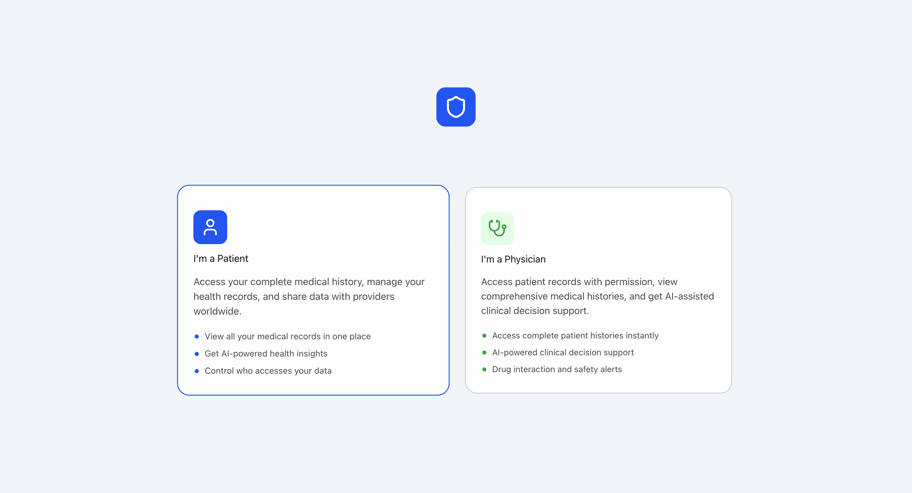
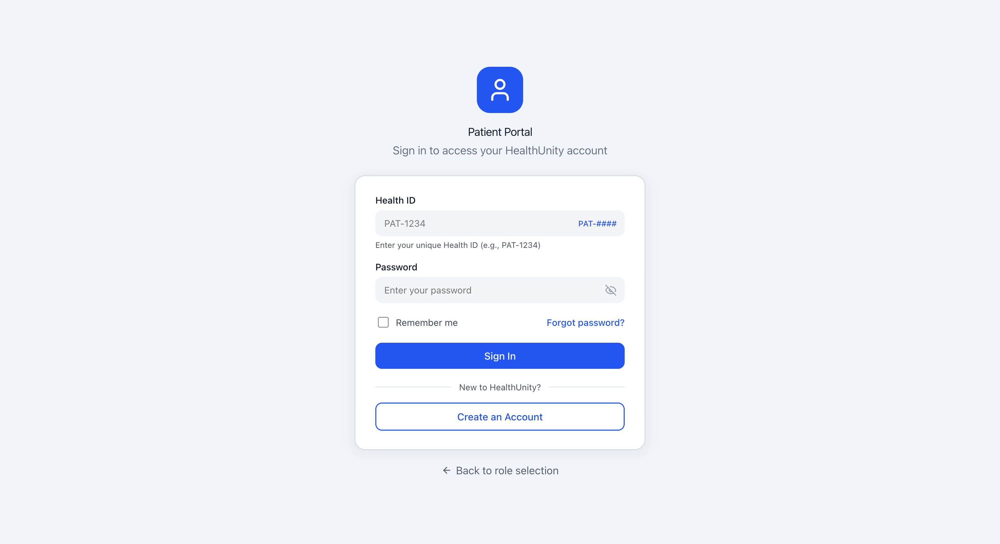
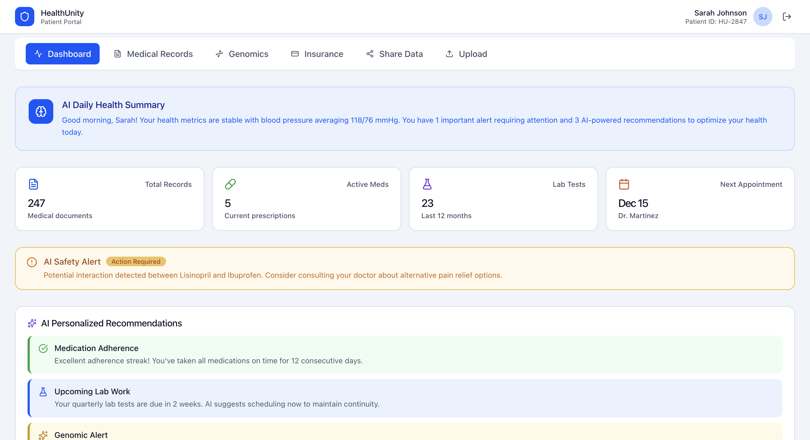

# Patient Portal

A full-stack, role-based patient portal built with React, TypeScript, Node.js/Express, and PostgreSQL. Features secure authentication, protected REST APIs, and modular dashboard workflows for patient and physician users.

## Screenshots

.png)

## Built With
Frontend: React, TypeScript, React Router, CSS, Lucide React

Backend: Node.js, Express, TypeScript, PostgreSQL, Argon2, JWT, CORS, cookie-parser

Tools: Postman, DBeaver

## Features Implemented

### Authentication & Security
- Argon2 password hashing for secure credential storage
- JWT-based authorization with protected route middleware
- Parameterized PostgreSQL queries to prevent SQL injection
- Role-based routing and access control (patient/physician)

### Backend API
- POST /auth/register — create a new patient or physician account
- POST /auth/login — authenticate and receive a JWT
- GET /patient/profile — retrieve patient profile data (protected)
- GET /patient/vitals — retrieve patient vitals (protected)
- GET /patient/records — retrieve medical records (protected)
- GET /patient/medications — retrieve medications (protected)
- GET /patient/appointments — retrieve appointments (protected)

### Frontend Workflows
- Role selection, login, forgot password, and account creation flows
- Modular patient dashboard with views for appointments, medications, medical records, vitals, genomics, and profile
- Dynamic routing and conditional rendering for role-specific user experiences

### In Progress
- Physician dashboard workflows
- Write/update routes for patient and physician interactions
- End-to-end live data integration across all dashboard modules
- Improved validation and error handling across API layers
