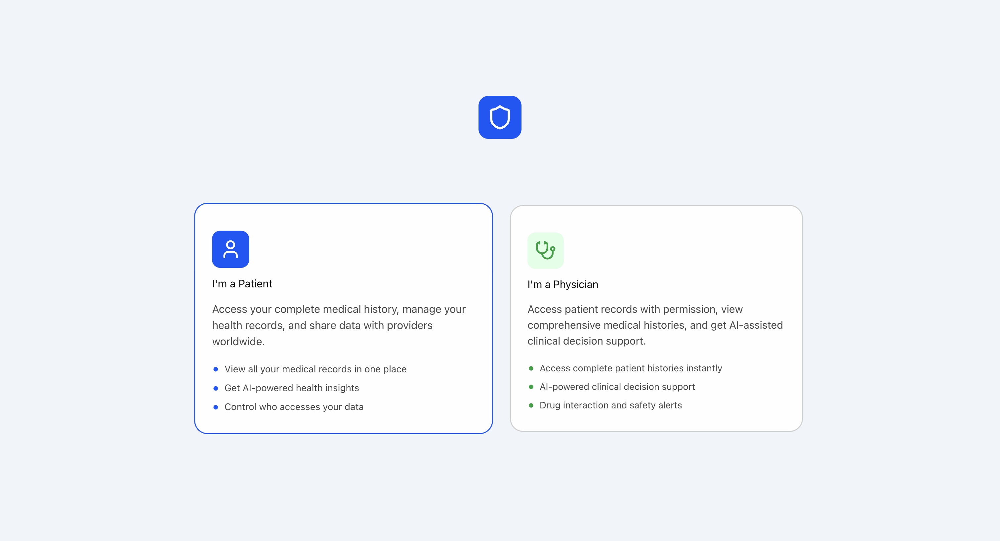
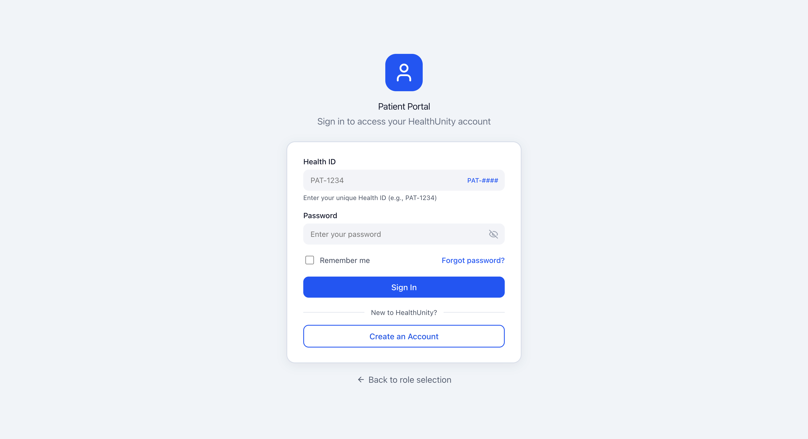
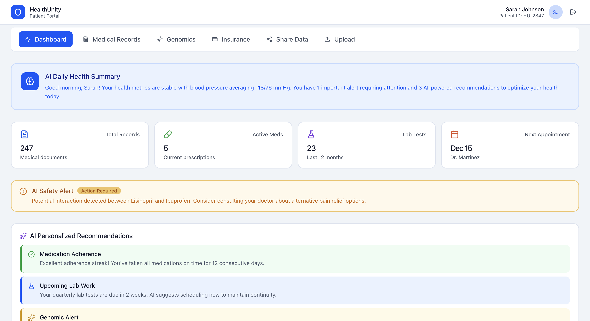

# HealthUnity Patient Portal

A full-stack, role-based healthcare portal (patient + physician) built with React, Express/TypeScript, PostgreSQL, and FHIR R4. Authentication and portal identity live in Postgres; clinical data is served from a local HAPI FHIR server seeded with Synthea synthetic patients.

## Screenshots




.png)

## Architecture

| Layer | Responsibility |
|-------|----------------|
| **PostgreSQL** | User accounts (`health_id`, role, email, password hash, `fhir_patient_id`) |
| **FHIR R4 (HAPI)** | Clinical resources — Patient demographics, Observations, meds, appointments, etc. |
| **Express BFF** | Auth, JWT protection, FHIR client helpers, profile enrichment |
| **React frontend** | Patient + physician dashboards and auth flows |

## Built With

**Frontend:** React, React Router, CSS, Lucide React  

**Backend:** Node.js, Express, TypeScript, PostgreSQL (`pg`), Argon2, JWT, Axios  

**Clinical / infra:** HAPI FHIR R4 (Docker), Synthea synthetic data  

**Tools:** Git/GitHub, Docker Compose, DBeaver

## Features Implemented

### Authentication & Security
- Argon2 password hashing and JWT bearer auth
- Role-based Health IDs (`PAT-####` / `PHY-####`)
- Patient registration matches a FHIR `Patient` by name + birthdate and stores `fhir_patient_id`
- Parameterized SQL; slim `users` table (no duplicated clinical demographics in Postgres)

### Backend API
- `POST /auth/register` — create account; link patients to FHIR
- `POST /auth/login` — Health ID + password → JWT
- `GET /health` — health check
- `GET /patient/profile` — protected; Postgres user + FHIR display name
- `GET /physician/patients` — protected; currently mocked pending FHIR Appointment search

### Frontend Workflows
- Role selection, login, forgot-password UI, and account creation
- **Patient portal (7 tabs):** Dashboard, Medical Records, Genomics, Insurance, Share Data, Upload, Appointments
- **Physician portal (6 tabs):** Dashboard, My Patients, Shared Access, AI Clinical Tools, Schedule, Insurance

## Getting Started

### Prerequisites
- Node.js + npm
- PostgreSQL (local DB, e.g. `patient_portal`)
- Docker (for HAPI FHIR)

### 1. Start the FHIR server

```bash
cd fhir-portal-infra
docker compose up -d
```

HAPI is available at `http://localhost:8080/fhir`.

### 2. Configure the backend

```bash
cd backend
cp .env.example .env   # or create .env manually
```

Example `.env`:

```env
PORT=3001
NODE_ENV=development
DATABASE_URL=postgresql://localhost/patient_portal
JWT_SECRET=your-secret-here
FHIR_BASE_URL=http://localhost:8080/fhir
```

Install and run:

```bash
npm install
npm run dev
```

### 3. Seed demo patients (optional)

With HAPI running and Synthea FHIR JSON under `synthea-generator/output/fhir/`:

```bash
cd backend
npm run seed
```

This uploads Synthea bundles to HAPI and inserts linked portal users (password: `Password123`). Health IDs are printed in the seed logs (random `PAT-####`).

### 4. Start the frontend

```bash
cd frontend
npm install
npm start
```

App runs at `http://localhost:3000` and talks to the API at `http://localhost:3001`.

## In Progress
- Wire patient vitals / records / medications / appointments to FHIR (Postgres clinical routes removed)
- Replace physician My Patients mock with FHIR Appointment search
- Write/update routes and sharing/consent APIs
- Live data for genomics, insurance, AI clinical modules (UI complete, data still demo/static)
- Stronger validation and role checks on protected routes
